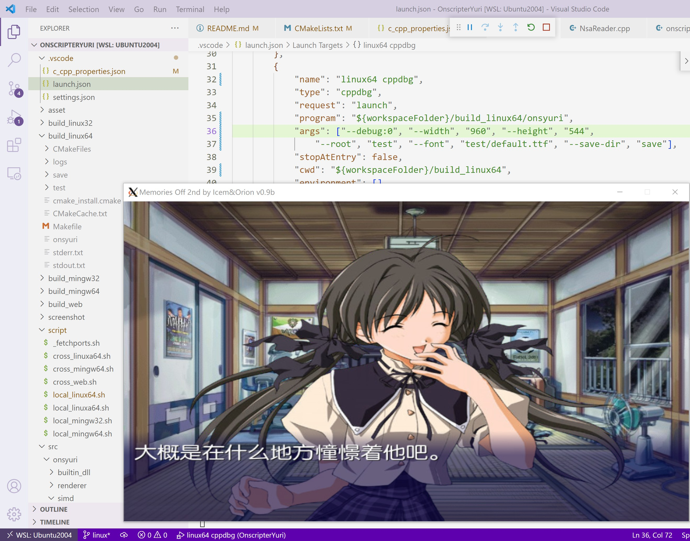

# Onscripter (Yuri)  

   &style=flat-square) &style=flat-square)

☘️ An ehancement Onscripter porting to many platforms, especially **web** ！  
This is base on [ONScripter-Jh](https://github.com/jh10001/ONScripter-Jh) by `SDL2`.  

Online Onscripter game demo: [lifegame](https://blog.schnee.moe/static/lifegame.html), [galgame_demo](https://onsgame.netlify.app/game/mo2_demo/)  


New features or plans:  

- develop
  - [x] clear camke project structure
  - [x] well documention for develop and usage
  - [x] scripts to compile or cross compile without pain
  - [x] vscode project for multi enviroment
  - [x] ci in github action to automaticly build  
- platform
  - [x] windows
    - [x] x86, x64 (local compile by msys2, static link)  
    - [x] x86, x64 (corss compile by mingw64, mingw32 from linux, static link)
    - [ ] cl compile
  - [x] linux
    - [x] x86, x64 (local compile, static or dynamic link)
    - [x] arm, aarch64 (cross compile, SDL2 build from raspberrypi, static link)
  - [x] web (by emscripten)
    - [x] fs to save in indexdb
    - [x] web lua script support
    - [ ] lazy load by BrowserFS or worker
    - [ ] preloading (future plan)
  - [ ] android (future plan)
    - [ ] support extern SD card by [SAF](https://github.com/YuriSizuku/android-SafFile)  
  - [x] psv, see [psv-Onscripter](https://github.com/YuriSizuku/psv-OnscripterJH)
- render
  - [x] support fullscreen by `--fullscreen` or `alt+enter`, scretch to fullscreen by `--fullscreen2` or `f11`  
  - [x] support arbitary resolution `--width`, `--height`  
  - [ ] video support (future plan)
- other
  - [x] support `nt2`, `nt3` encryption format by Mine
  - [x] support long click or touch to invoke menu  
  - [x] fix some bugs in origin version (can not read `00.txt` problem)  

## 1. Usage

### (1) general command

``` bash
./onsyuri --help
./onsyuri --root /path/to/game --save-dir /path/to/save --font /path/default.ttf
./onsyuri --width 1280 --height 720 --enc:sjis
./onsyuri --fullscreen2 # fullscreen1 alt+f4, fullscreen2 f11
```

❗ If you force exit the game, the save might be damaged, try to remvoe envdata to play again.

### (2) linux

You can either download the prebuild static elf from the [release](https://github.com/YuriSizuku/OnscripterYuri/releases) or build from source (see next part).  

  

### (3) web

This project can run in a browser through hosted web server.  
Press `F11` to strech full in a webpage, long click (touch also) to invoke game menu.
It might need some time to load at first without lazyload now.  

The structure is as bellow:  

``` bash
onsyuri.html
onsyuri.js
onsyuri.wasm
onsyuri_index.json
[your game files]

```

It will load the game according to `onsyuri_index.json`, whitch is deifned by `<meta onsyuri_index="onsyuri_index.json">` in `onsyuri.html`.  

``` json
{
  "title": "game1",
  "gamedir": "/onsyuri/game1",
  "savedir": "/onsyuri_save/game1",
  "args", [],
  "files":[
    {"path": "0.txt" , "url":"http://localhost:5500/asset/test/0.txt"},
    {"path": "bgm/bgm.ogg" , "url":"http://localhost:5500/asset/test/bgm/bgm.ogg"},
    {"path": "default.ttf" , "url":"http://localhost:5500/asset/test/default.ttf"}
  ]
}

```

This can be generated by `onsyuri_index.py`.

## 2. Build

### (1) local windows  

Install the dependency in msys2,  

``` sh
pacman -Syu --noconfirm
pacman -S --noconfirm make tar vim curl # util tools
pacman -S --noconfirm mingw-w64-x86_64-binutils mingw-w64-x86_64-gcc mingw-w64-x86_64-gdb # mingw64 compile tool
pacman -S --noconfirm mingw-w64-i686-binutils mingw-w64-i686-gcc mingw-w64-i686-gdb # mingw32 compile tool

pacman -S --noconfirm mingw-w64-i686-SDL2 mingw-w64-x86_64-SDL2
pacman -S --noconfirm mingw-w64-i686-SDL2_image mingw-w64-x86_64-SDL2_image
pacman -S --noconfirm mingw-w64-i686-SDL2_ttf mingw-w64-x86_64-SDL2_ttf
pacman -S --noconfirm mingw-w64-i686-SDL2_mixer mingw-w64-x86_64-SDL2_mixer

pacman -S --noconfirm mingw-w64-i686-brotli mingw-w64-x86_64-brotli
pacman -S --noconfirm mingw-w64-i686-mesa mingw-w64-x86_64-mesa
pacman -S --noconfirm mingw-w64-i686-lua mingw-w64-x86_64-lua
```

and then use these `local_mingw32.sh` or `local_mingw64.sh` to build.

``` sh
cd script
chmod +x *.sh
sh -c "export BUILD_TYPE=Debug && export MSYS2SDK=/path/to/msys2 && ./local_mingw32.sh"
```  

### (2) local linux  

Install the dependency  

``` bash
# linux64
sudo apt-get update
sudo apt-get -y install gcc gdb make cmake git curl
sudo apt-get -y install libsdl2-dev libsdl2-ttf-dev libsdl2-image-dev libsdl2-mixer-dev
sudo apt-get -y install libbz2-dev libjpeg-dev libpng-dev
sudo apt-get -y install liblua5.3-dev libgl1-mesa-dev

# linux32
sudo dpkg --add-architecture i386 
sudo apt-get update
sudo apt-get -y install gcc-multilib g++-multilib
sudo apt-get -y install libsdl2-dev:i386 libsdl2-ttf-dev:i386 libsdl2-image-dev:i386 libsdl2-mixer-dev:i386
sudo apt-get -y install libbz2-dev:i386 libjpeg-dev:i386 libpng-dev:i386
sudo apt-get -y install liblua5.3-dev:i386 libgl1-mesa-dev:i386
```  

``` sh
cd script
chmod +x *.sh
sh -c "export BUILD_TYPE=Debug && ./local_linux32.sh"
```  

and then use `local_linux32.sh` or `local_linux64.sh` to build.  

### (3) cross web  

Install [emsdk](https://github.com/emscripten-core/emsdk) and use `cross_web.sh` to build.  

``` shell
cd script
chmod +x *.sh
sh -c "export BUILD_TYPE=Debug && export EMCSDK=/path/to/emsdk && ./cross_web.sh"
```

### (4) cross linux arm

This is aimed for raspberrypi or the other arm64 devices cross compiling.
As there are many system bindings in SDL2,  
just build libraries in the target machine, and use these build cache to link.  


Install the dependency for aarch64 cross compiler,  

``` shell
# install in the target machine
sudo apt-get -y install libx11-dev libxext-dev libasound2-dev

# install in the local machine
sudo apt-get -y install tar make cmake curl git
sudo apt-get -y install crossbuild-essential-armhf
sudo apt-get -y install crossbuild-essential-arm64
```

then use `cross_linuxa64.sh` or `cross_linuxa32.sh` to compile.  

```shell  
# at first build sdl2 in raspberry pi
sh -c "export SYSROOT=/ && ./local_linux64.sh"

# copy prebuild of dependency to local
cp -rf /path/to/rpi/OnscripterYuri/thirdparty/build/arch_aarch64 thirdparty/build/arch_aarch64

# use SKIP_PORTS to skip thirdpart builds
cd script
chmod +x *.sh
sh -c "export BUILD_TYPE=Debug && export SKIP_PORTS=yes && ./local_linux64.sh"
```  

### (5) cross mingw  

Install mingw cross compiler and tools,  

``` shell  
sudo apt-get -y install tar make cmake curl git
sudo apt-get -y install mingw-w64 zstd # do not install mingw-w64-tools, this pkg-config is broken
```

then use `cross_mingw32.sh` or `cross_mingw64.sh` to compile.

## 3. Compatibility  

|game|version|status|description|
|----|-------|------|-----------|

## 4. Issues (including already solved)  

- general  
  - release file too big, this is because of static link all libraries for better compatibility
- windows  
- linux  
- android  
- web  
  - [ ] lazy load in workerfs not work, see this [issue](https://github.com/emscripten-core/emscripten/issues/18698)  
